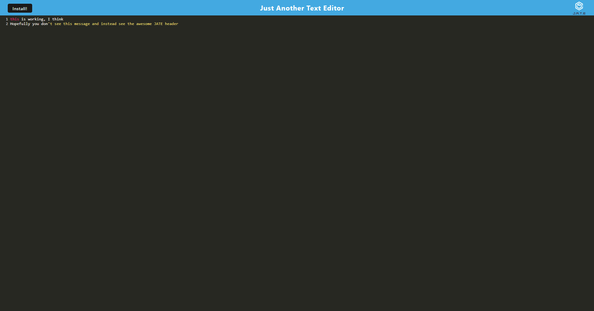

# Creative-Text-Editor-Name

## Description

This application is a text editor that focuses on progress web app concepts. This means the app should be downloadable to your desktop via manifest. It should retain some offline functionality if there is no network connection. When the app is opened on the browser again all the progress made offline should be reflected. The new technology utilized in this application include concurrently, webpack, manifest and babel. 

## Table of Contents

- [Installation](#installation)
- [Usage](#usage)
- [Credits](#credits)
- [License](#license)

## Installation

A user just needs to navigate to the link below to access this application! They can then click on the install button to download it to their local machine and use it offline/online as they choose. 

[Live App](https://creative-text-editor-name.herokuapp.com/)

## Usage

To use this application, begin by navigating to to URL linked in the installation section. You can use the text editor on the browser itself or download a local version to use offline by clicking on the install button in the top left corner. The local and web versions are synchronous meaning any changes to one will carry over to the other. 

## Credits

I referenced many classroom activities to familiarize myself with the use of webpack, manifest, concurrently and babel. 

## License

The MIT License (MIT)

Copyright (c) 2015 Chris Kibble

Permission is hereby granted, free of charge, to any person obtaining a copy of this software and associated documentation files (the "Software"), to deal in the Software without restriction, including without limitation the rights to use, copy, modify, merge, publish, distribute, sublicense, and/or sell copies of the Software, and to permit persons to whom the Software is furnished to do so, subject to the following conditions:

The above copyright notice and this permission notice shall be included in all copies or substantial portions of the Software.

THE SOFTWARE IS PROVIDED "AS IS", WITHOUT WARRANTY OF ANY KIND, EXPRESS OR IMPLIED, INCLUDING BUT NOT LIMITED TO THE WARRANTIES OF MERCHANTABILITY, FITNESS FOR A PARTICULAR PURPOSE AND NONINFRINGEMENT. IN NO EVENT SHALL THE AUTHORS OR COPYRIGHT HOLDERS BE LIABLE FOR ANY CLAIM, DAMAGES OR OTHER LIABILITY, WHETHER IN AN ACTION OF CONTRACT, TORT OR OTHERWISE, ARISING FROM, OUT OF OR IN CONNECTION WITH THE SOFTWARE OR THE USE OR OTHER DEALINGS IN THE SOFTWARE.

## Badges

## How to Contribute

If you have any questions or contributions, please don't hesitate to reach out via email at [danny.mak2@gmail.com](mailto:danny.mak2@gmail.com) or through my [GitHub profile](https://github.com/dannymak1993).
